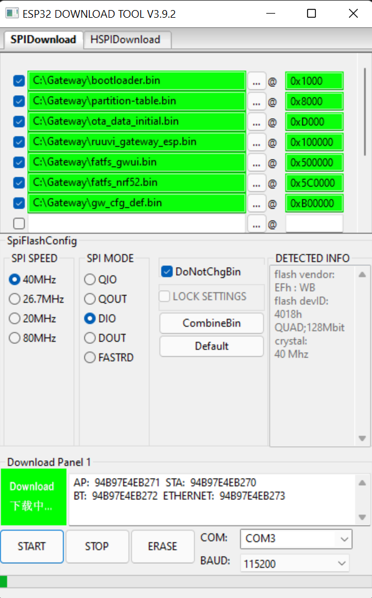
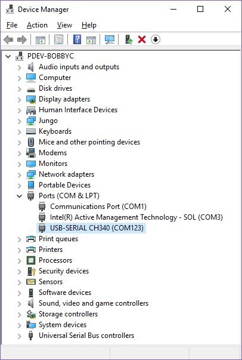
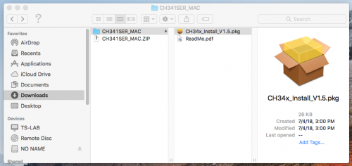
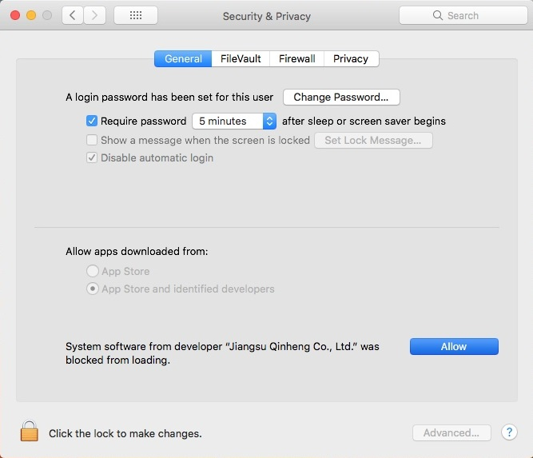
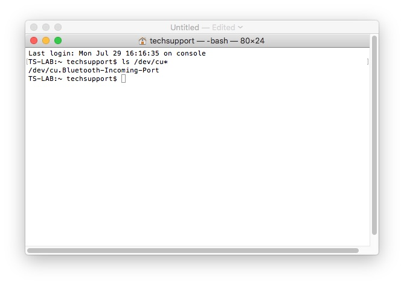
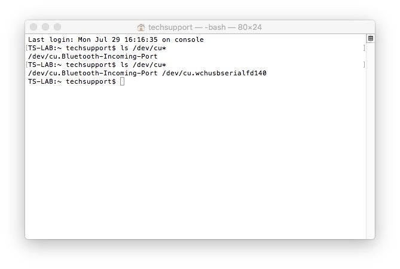

# Ruuvi Gateway ESP32 firmware

Developed with:
* Hardware: Ruuvi Gateway Rev A2.
* ESP-IDF version [v4.2.2](https://github.com/espressif/esp-idf/releases/tag/v4.2.2)

Latest documentation and roadmap is at https://docs.ruuvi.com/gw-esp32-firmware. 


## Installing Prerequisites

### Driver installation for the USB-to-Serial converter **CH340**

The Ruuvi Gateway contains a USB-to-Serial converter **CH340**, so to communicate with it, you
need drivers for this chip.

All modern operating systems already have support for the USB-to-Serial converter **CH340**.
However, if you have any problems, you can try to [reinstall the driver yourself](#ch340-drivers-installation).

### ESP-IDF framework and toolchain installation

If you want to build firmware from source, you will need to install the ESP-IDF framework and 
the toolchain to compile code for ESP32. See the
[Getting Started Guide](https://docs.espressif.com/projects/esp-idf/en/v4.2.2/esp32/get-started/index.html)
for detailed instructions on how to install all the necessary components for the various platforms. 

**Please note that you need to install ESP-IDF version v4.2.2**:
```shell
git clone -b v4.2.2 --recursive git@github.com:espressif/esp-idf.git
```

### The console utility `esptool.py`

If you don't want to build firmware from source, but just want to flash pre-built images, then you
can simply install the Python package `esptool`:

```shell
pip install esptool
```

### The GUI tool `Flash Download Tools` (Windows only)

On the Windows platform, the `Flash Download Tools` GUI tool is available for firmware flashing:
[download](https://www.espressif.com/en/support/download/other-tools).


### Serial Terminal Emulator Software

Installation of the Serial Terminal Emulator Software is not necessary on Mac/Linux, as these
operating systems contain such software.

Here are some of the most popular GUI applications:

* [PuTTY](https://www.putty.org/) (Windows/Linux)
* [SecureCRT](https://www.vandyke.com/products/securecrt/index.html) (Windows/Mac/Linux)

Connect your serial monitor to the virtual COM/serial port at 115200 BAUD to read the log output.


## Connecting Ruuvi Gateway to USB

Once the Ruuvi Gateway is connected to USB, a virtual serial port (COM port) will be created.
You can connect to the created virtual serial port and view the bootlog/syslog using any serial
terminal emulator program. 

**Note**: The driver for the USB-to-Serial converter CH340 must be pre-installed.
All modern operating systems already have support for the USB-to-Serial converter **CH340**.
However, if you have any problems, you can try to [reinstall the driver yourself](#ch340-drivers-installation).

### Windows

To check that the CH340 enumerates to a COM port, you can open the device manager.
After opening the device manager, you will need to open the "Ports (COM & LPT)" tree. 
The Ruuvi Gateway should show up as "USB-SERIAL CH340 (COM##)". 
Depending on your computer, the COM port may show up as a different number.

### Mac OS X

**Warning**: If you have a **Mac OS X v10.12+** (i.e. **High Sierra**, **Mojave**), your computer
may restart as soon as you insert the Ruuvi Gateway to your computer.
It's recommended to uninstall the old drivers first and follow these directions below before
connecting the Ruuvi Gateway to your COM port.
If you observe this issue, you will need to unplug the Ruuvi Gateway from your USB port,
restart the computer, and follow [these steps](#ch340-drivers-installation) to reinstall the latest drivers.

To verify that your driver is working, you should see a difference in the following command output
before and after plugging the Ruuvi Gateway to a USB port.

Open **Terminal**, then run the following command:
```shell
ls /dev/cu* 
```
A list of devices connected to your Mac's COM ports will be displayed as a result. The Ruuvi Gateway
should show up as **/dev/cu.wchusbserial####**. 
Depending on your computer, the COM port may show up as a different number.

### Linux

To verify that your driver is working, you should see a difference in the following command output
before and after plugging the Ruuvi Gateway to a USB port.

Open **Terminal**, then run the following command:
```shell
ls /dev/ttyUSB*
```
A list of devices connected to your COM ports will be displayed as a result. The Ruuvi Gateway
should show up as /dev/ttyUSB*. Depending on your computer, the COM port may show up as
a different number.


## Build and Flash

### Build firmware from source

Get the source code from GitHub:
```shell
git clone --recursive https://github.com/ruuvi/ruuvi.gateway_esp.c.git
```

Or update all components to the latest version:
```shell
git submodule update --init --recursive
```

To build the project use `idf.py`:
```shell
idf.py build
```

### Download prebuilt images

Release versions of Ruuvi Gateway firmware can be downloaded from here: 
[releases](https://github.com/ruuvi/ruuvi.gateway_esp.c/releases).

Pre-built images of firmware versions for developers can be found here: 
[Ruuvi Jenkins](https://jenkins.ruuvi.com/job/ruuvi_gateway_esp-PR/).

### Flash the firmware images

#### Flashing with `idf.py`

**Note**: To use `idf.py` you need to have ESP-IDF framework installed.

To flash firmware and display serial output:
```shell
idf.py -p <PORT> flash monitor
```
To exit the serial monitor, type ``Ctrl-]``.

To flash firmware without displaying serial output:
```shell
idf.py -p <PORT> flash
```

You can also run serial monitor without flashing:
```shell
idf.py -p <PORT> monitor
```

#### Flashing with `esptool.py`

**Note**: To use `esptool.py` you need to have the Python package `esptool` installed.

The compiled files are located here:
* build/binaries_v1.9.2/bootloader.bin
* build/binaries_v1.9.2/partition-table.bin
* build/ota_data_initial.bin
* build/ruuvi_gateway_esp.bin
* build/fatfs_gwui.bin
* build/fatfs_nrf52.bin

```shell
esptool.py -p (PORT) -b 460800 --before default_reset --after hard_reset --chip esp32 \
    write_flash \
    --flash_mode dio --flash_size detect --flash_freq 40m \
    0x1000 bootloader.bin \
    0x8000 partition-table.bin \
    0xd000 ota_data_initial.bin \
    0x100000 ruuvi_gateway_esp.bin \
    0x500000 fatfs_gwui.bin \
    0x5C0000 fatfs_nrf52.bin
```

If you are using a newer format of partition table with support for custom default configuration,
then you need to use the following command with an extra argument to flash gw_cfg_def.bin.

The compiled files are located here:
* build/binaries_v1.9.2/bootloader.bin
* build/partition_table/partition-table.bin
* build/ota_data_initial.bin
* build/ruuvi_gateway_esp.bin
* build/fatfs_gwui.bin
* build/fatfs_nrf52.bin
* build/gw_cfg_def.bin

```shell
esptool.py -p (PORT) -b 460800 --before default_reset --after hard_reset --chip esp32 \
    write_flash \
    --flash_mode dio --flash_size detect --flash_freq 40m \
    0x1000 bootloader.bin \
    0x8000 partition-table.bin \
    0xd000 ota_data_initial.bin \
    0x100000 ruuvi_gateway_esp.bin \
    0x500000 fatfs_gwui.bin \
    0x5C0000 fatfs_nrf52.bin \
    0xB00000 gw_cfg_def.bin
```

On Windows you can use GUI tool `Flash Download Tools` with the following settings.
**Note:** If you're not using the partition with the custom default configuration, 
simply uncheck the checkbox next to "gw_cfg_def.bin".


### Flashing nRF52 co-processor

Once you have flashed the firmware using any of the above methods, the firmware image for the 
nRF52 will be written to the ESP32 flash memory (fatfs_nrf52.bin).

After the ESP32 firmware flashing is completed, it will be restarted. 
And during the boot-up the software versions in the nRF52 and in the ESP32 flash memory are 
compared.
If the versions are different, ESP32 starts the process of updating the nRF52 firmware.
This process can take a long time (approximately 5 minutes) and during this time the red LED will
flash for 100ms every second.

### Creating a custom default gateway configuration

1. Create copy of "gw_cfg_default" folder, modify gw_cfg_default.json as you require.
2. Execute command to generate binary gw_cfg_def.bin:
```shell
python $IDF_PATH/components/nvs_flash/nvs_partition_generator/nvs_partition_gen.py generate gw_cfg_def_partition.csv gw_cfg_def.bin 0x40000
```

### Reproducible build

All binaries, except the bootloader, are reproducible.
This means that they are independent of the project path, ESP_IDF toolkit path or compilation
date/time.

But to remove absolute paths you need to use small workaround:
```shell
idf.py build
touch CMakeLists.txt
idf.py build
```

# CH340 drivers installation

The Ruuvi Gateway contains a USB-to-Serial converter **CH340**, so to communicate with it, you 
need drivers for this chip.
All modern operating systems already support the **CH340** USB-to-serial converter, but if you have
problems you can try installing the manufacturer's drivers (or a patched version).

The CH340 is made by [WCH](http://www.wch-ic.com). You can find the latest version of their 
drivers in their [English translated website](http://www.wch-ic.com/downloads/CH341SER_ZIP.html) 
or in their [website in Mandarin](http://www.wch.cn/downloads/CH341SER_ZIP.html).

If you have the older CH340 drivers installed, you may need to update them. The following sections
provide instructions on how to do this for each of the operating systems tested.

## CH340 drivers installation for Windows

Disconnect Ruuvi Gateway from USB port before installing driver.

Download and execute **CH341SER.EXE** 
from the [link](http://www.wch-ic.com/downloads/CH341SER_ZIP.html).


Click the "**Uninstall**" button first. Then click on the "**Install**" button.

Connect Ruuvi Gateway to USB port and check that it enumerates to a COM port.
Open the device manager, then find and open the "Ports (COM & LPT)" tree.
The Ruuvi Gateway should show up as "USB-SERIAL CH340 (COM##)".
Depending on your computer, the COM port may show up as a different number.



## CH340 drivers installation for Mac OS X

**Warning**: If you have a **Mac OS X v10.12+** (i.e. **High Sierra**, **Mojave**), your computer
may restart as soon as you insert the Ruuvi Gateway to your computer.
It's recommended to uninstall the old drivers first and follow these directions below before
connecting the Ruuvi Gateway to your COM port.
If you observe this issue, you will need to unplug the Ruuvi Gateway from your USB port,
restart the computer, and follow the steps below to reinstall the latest drivers.

Open the **Terminal** and do the following:
You'll need to move to the directory where the *.kext files are stored.
* For Mac OSX v10.9+, you will need to use this command:
```shell
cd /Library/Extensions
```
* For Mac OSX v10.8 and below, you will need to use this command:
```shell
cd /System/Library/Extensions
```

To check to see if the CH340 driver is in the correct path, use the following command to list the contents of the folder.
```shell
ls
```

To look for CH340 driver files (i.e. usb.kext or usbserial.kext) in the path, you could use the following command.
```shell
ls | grep usb
```

You should see something similar to the output below after using the commands:


Once you have found the file in the path, you will need to run each of the following commands in the
Terminal to remove the old CH340 drivers. In this case there was only the **usbserial.kext** file,
but there is no harm in running both commands. Make sure you have administrator privileges to ensure
that the drivers are removed.

```shell
sudo rm -rf /Library/Extensions/usb.kext
sudo rm -rf /Library/Extensions/usbserial.kext
``` 

Check if the old drivers were removed in the paths by using the `ls` command:
```shell
ls
```


[Download](http://www.wch-ic.com/downloads/CH341SER_MAC_ZIP.html) and extract the folder **CH341SER_MAC_ZIP**.

Then, open the "*.pkg" file from the unzipped folder and follow the instructions. You'll need to
restart your computer for the changes to take effect.



**Note**: Depending on your settings, you may need to adjust your Security & Privacy settings to
allow the CH340 drivers to function. A window may pop up indicating that the drivers have been block
as shown in the image below.


If you receive a window that indicates that the system extension is blocked, you'll need to open a
search with Spotlight by pressing ⌘ (**Command**) + **Space Bar**. Type **Security & Privacy** and
click on the "**Allow**" button to enable the CH340 drivers.



To verify that your driver is working, you should see a difference in the following pictures 
after plugging the Ruuvi Gateway to a USB port.

Open Terminal and run the following command:
```shell
ls /dev/cu* 
```

A list of devices connected to your Mac's COM ports will be displayed as a result. Assuming that the
Ruuvi Gateway is not connected to your computer, you should see something similar to the image 
below.



Connect the Ruuvi Gateway to one of your Mac's COM ports. 
Check for the following changes. 
The Ruuvi Gateway should show up as **/dev/cu.wchusbserial####**.
Depending on your computer, the COM port may show up as a different number.



## CH340 drivers installation for Linux

Most modern Linux distributions already include the CH340 driver and to get the latest version,
simply run a system update:

```shell
sudo apt-get update
sudo apt-get upgrade
```

For the Linux distributions that don't have the CH340 driver, 
you can download and install the driver from 
the [manufacturer's website](http://www.wch-ic.com/downloads/CH341SER_LINUX_ZIP.html).

**Note**: There are some reported cases of serial communication failure when using the factory 
drivers in Linux.

It is strongly recommended that you install the patched drivers from 
[GITHUB CH340 Linux patched drivers](https://github.com/juliagoda/CH341SER).

* Plug and unplug your Ruuvi Gateway from the USB port
* Type `dmesg` to see what has happened. The expected output (shows "ch341") should have the
  following in the recent log:
```text
[  xxx] ch341-uart ttyUSB0: ch341-uart converter now disconnected from ttyUSB0
[  xxx] ch341 3-2:1.0: device disconnected
```
* Unpack the archive with the patched driver
* `cd` into the directory where the files are saved
* `make clean`
* `make`
* `sudo make load`
* `sudo rmmod ch341` to uninstall the broken driver
* `lsmod | grep ch34` to list what modules are currently installed
* Plug and unplug your Ruuvi Gateway again on the USB port
* `dmesg` and check the output (should show "ch34x" now):
```text
[  xxx] ch34x ttyUSB0: ch34x converter now disconnected from ttyUSB0
[  xxx] ch34x 3-2:1.0: device disconnected
```

To verify that your driver is working, you should see a difference in the following command output
before and after plugging the Ruuvi Gateway to a USB port.

Open **Terminal**, then run the following command:
```shell
ls /dev/ttyUSB*
```
A list of devices connected to your COM ports will be displayed as a result. The Ruuvi Gateway
should show up as /dev/ttyUSB*. Depending on your computer, the COM port may show up as
a different number.

**Note**: Depending on your root permissions, you may need to configure the serial port with the 
following two commands. 
Make sure to adjust the **$username** with respect to the user ID that is currently logged in 
(depending on your computer, the **/dev/ttyUSB0** may be different).

```shell
sudo usermod -a -G dialout $username 
sudo chmod a+rw /dev/ttyUSB0
```
